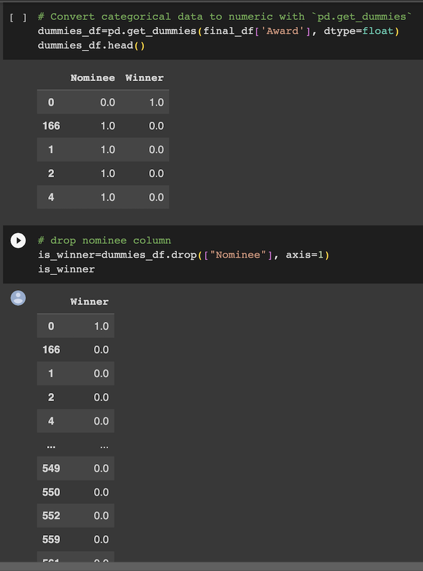

# Final-Project

**Predicting Oscar Winners With Machine Learning**
-
**Contributers:**  Ruth Ashaolu, Nicole Bustamante, Gabriela Lopez, Kiana Navarre, Sarah Peterson, Kieran Taylor

**Project Objective:**  This Project aims to use machine learning techniques to inform production companies, streaming services, or industry professionals of critically acclaimed movies. We believe that data science and machine learning models support the arts by offering actionable insights and increasing consumer engagement. 

**Benefits of Data Science/ ML Models in Media and Entertainment:**  
The Oscars are a highly visible event, gaining mass attention from the media, individuals in the arts and entertainment industries and movie-goers. Research shows that more than 40 million viewers tune in to watch the Oscars. The film and entertainment industries are highly profitable and having predictive models such as this will continue to support and promote success in the arts (Gold et al., 2013).

**ETL and Preprocessing:**
-
Once we identified our dataset, we identified, cleaned, and preprocessed our target and features variables. Our target variable is the 'Award' column (a categorical variable indicating either 'Winner' or 'Nominee'), which we one hot encoded with get dummies. We then dropped the nominee column and were left with a column called 'Winner' indicating either a positive class 1= Winner, or negative class 0= Nominee.

We then used a number of functions including regex to split and clean our feature variables including IMDB rating, movie time, production studio, genre, and director nominations. 

