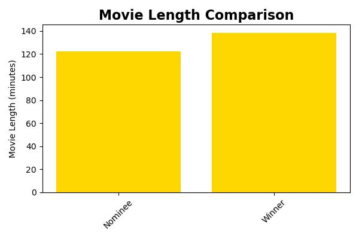
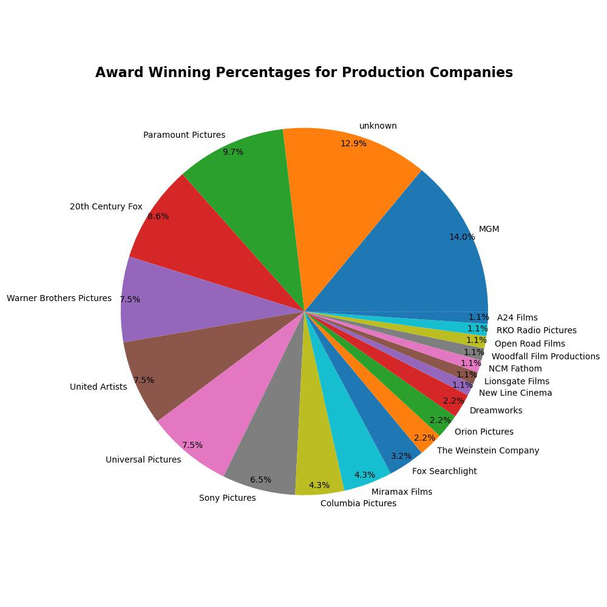

# Final-Project

**Predicting Oscar Winners With Machine Learning**
-
**Contributers:**  Ruth Ashaolu, Nicole Bustamante, Gabriela Lopez, Kiana Navarre, Sarah Peterson, Kieran Taylor

**Project Objective:** This project aims to utilize machine learning techniques to provide valuable information to production companies, streaming services, and industry professionals regarding critically acclaimed movies. 

By harnessing the power of data science and machine learning models, our project not only supports the arts but also delivers actionable insights and enhances consumer engagement. 

Furthermore, informing our target audience about future Oscar winners would be highly beneficial, as it enables them to stay ahead of the curve, make informed decisions, and maximize their chances of success in the industry.

**Exploratory Data Analysis**
-
This project also involved preforming an exploratory analysis on the dataset in order to gain a better understanding of general themes associated with Oscar winners and nominees. Below are several visualizations we created using Matplotlib

**Step 1: ETL and Preprocessing:**
-
Once we identified our dataset, we identified, cleaned, and preprocessed our target and features variables. We used a number of functions including regex to split and clean our feature variables including IMDB rating, IMDB votes, content time, movie rating, production studio, genre, and director nominations. 

Our target variable is the 'Award' column (a categorical variable indicating either 'Winner' or 'Nominee'), which we one hot encoded with `pd.get_dummies`. We then dropped the nominee column and were left with a column called 'Winner' indicating either a positive class 1= Winner, or negative class 0= Nominee.

We then seperated our features from our target varible in preparation to split the data into test/train groups and scale.

**Step 2: Split and Scale**
-
Next, we split the dataset into training and test sets using `train_test_split()` from scikit-learn. Then, we scaled our data using `StandardScalar()` from scikit-learn. 

**Step 3: Model Selection, Training and Evaluation**
-
When selecting our model we experimented with other models and techniques before deciding on the RandomForestClassifer. We did this by training each model on the training data and evaluating its performance on the test data using classification reports. 

We then found that RandomForestClassifer consistently generated the highest accuracy, precision, and recall scores.

**First Attempt: Logisitic Regression:**

**Second: Attempt: Logistic Regression with RandomOverSampler**

**Third Attempt: RandomForestClassifer**

**Optimization, Predictions and Findings**
-
Once we identified the RandomForestClassifer as the best option for our model, we tuned the hyperparameters to ensure optimal performance. X and y variables are concatenated five times using `pd.concat()` to create new variables X_2 and y_2. This is done to increase the size of the dataset for training and testing purposes.
We also adjusted the hyperparameter `max_depth` to 10 in order to avoid over-fitting or under-fitting our model. 

Overall, the RandomForestClassifier model achieved a high accuracy of 93% in predicting Oscar winners. It showed strong precision for the "0.0" class (Oscar nominees) and "1.0" class (Oscar winners). However, recall was relatively lower  for the "1.0" class (Oscar winners). Further analysis and refinement may be needed to improve the model's ability to correctly identify Oscar winners while maintaining a high overall accuracy.
